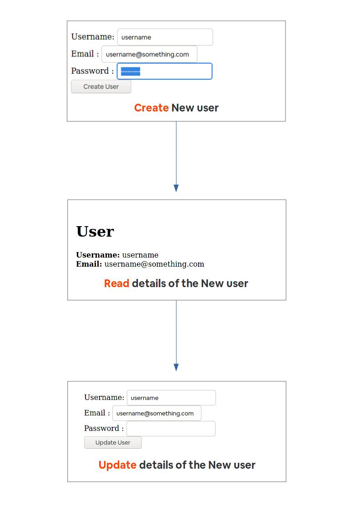

<h1 align="center">Reformer</h1>

---

### About 
This repo contains the result of Odin Project's "Bare Metal Forms and Helpers" tutorial. The project requires us to intially create forms with bare html and then user Rails form helpers to create the same form.


## Available Features
This application provides Create, Read, and Update functionalities with respect to User model.

In simple words:
- User can be created
- User details can be viewed
- User details can be updated

The basic functionalities of the application can be seen in the following screenshot




## Prerequisites
Prior to using this app, please make sure you have the _Ruby_ and _Ruby On Rails_ installed.

## Getting Started


### Step 1: Cloning the repo

To get started you have to clone the repo on your local machine. To clone the repo run the following command in a terminal emulator:
   
```
git clone https://github.com/smcommits/micro_reddit
```
       
Alternatively, you can click [this link](https://github.com/smcommits/re-former/archive/develop.zip) to download the repo as a zip file.

### Step 2: Navigation

Now navigate to the repo

```
cd re-former
```

### Step 3: Installing Dependencies

Use following command to install all the dependencies

```
bundle install
```

### Step 4: Database Migration

Use the following command to migrate the database

```
rails db:migrate
```
### Step 5: Launching Rails Server

Launch rails server using the following command

```
rails server
```

### Step 6: Launching application using the url

Finally, visit the application using the local address generated by rails server. 

Look for something like the following line in your server console, the url will be the address to access the application.

```
Listening on tcp://127.0.0.1:3000
```


## Under the hood
This project is designed using the web development framework **Ruby On Rails**

## Authors

👤 **Anas Siddiqui**

- GitHub: [Anas Siddiqui](https://github.com/smcommits)
- LinkedIn: [Anas Siddiqui]( www.linkedin.com/in/sm-anas)


## 🤝Contributing

Contributions, issues, and feature requests are welcome!

## Show your support

Give a ⭐️ if you like this project

## Acknowledgement


[Ruby Guides](https://guides.rubyonrails.org/) was a crucial resource that helped in successfully developing the project. 

